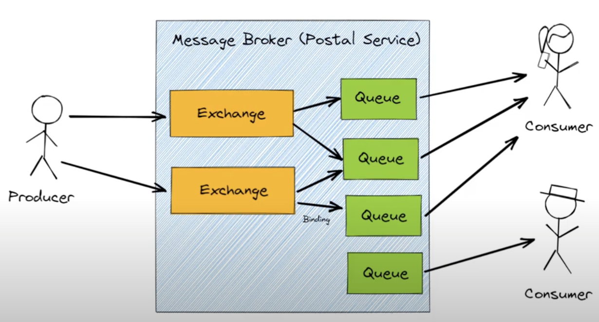
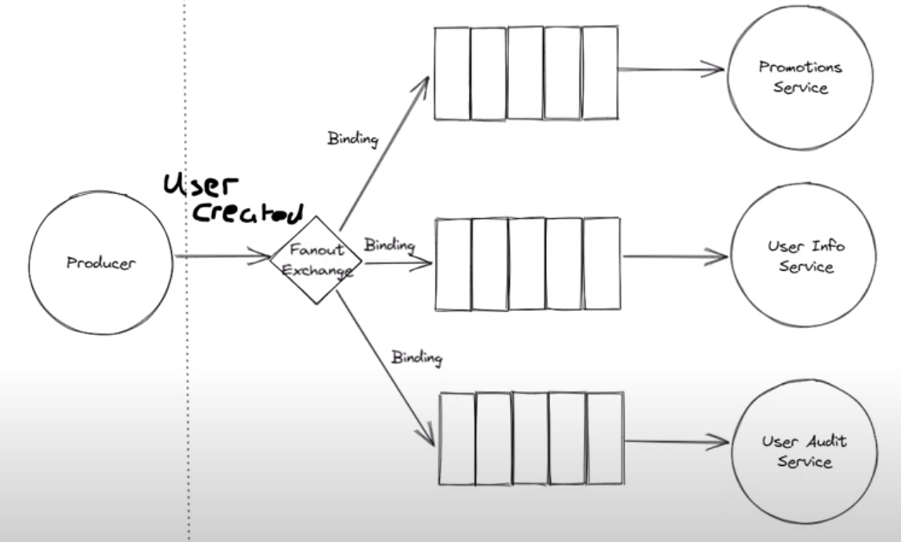
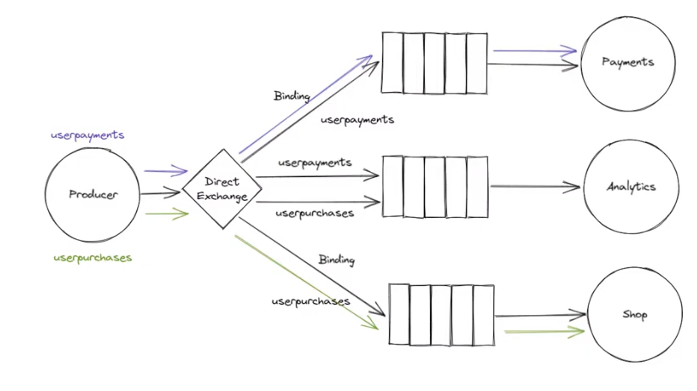
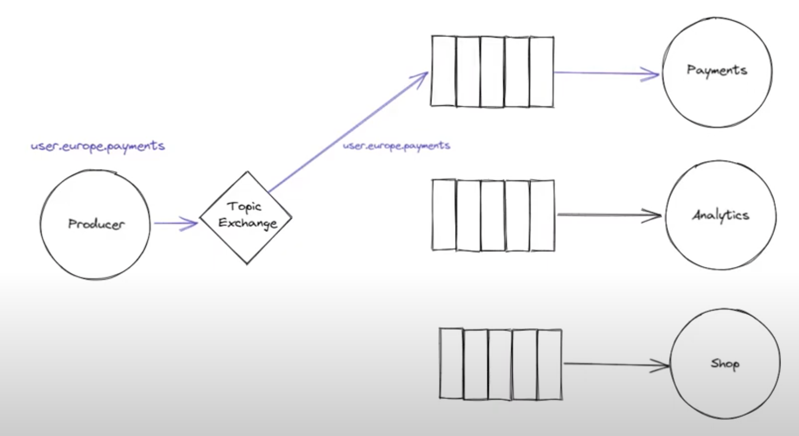
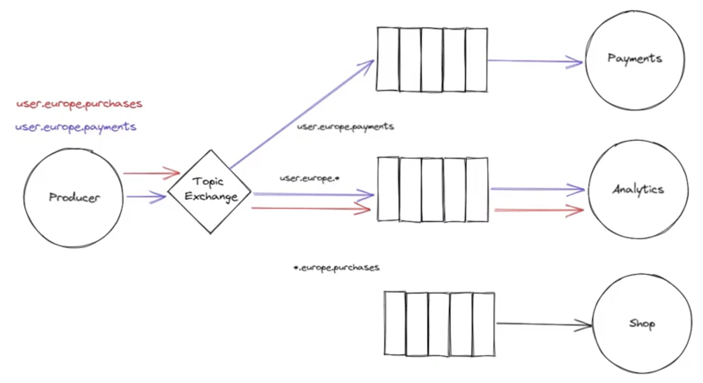
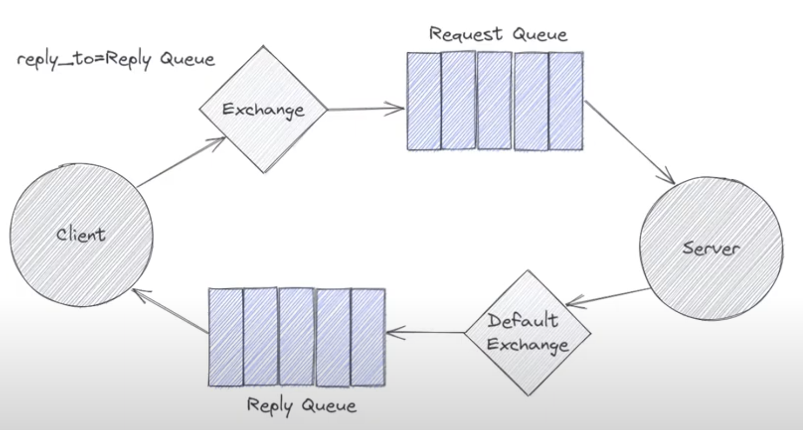
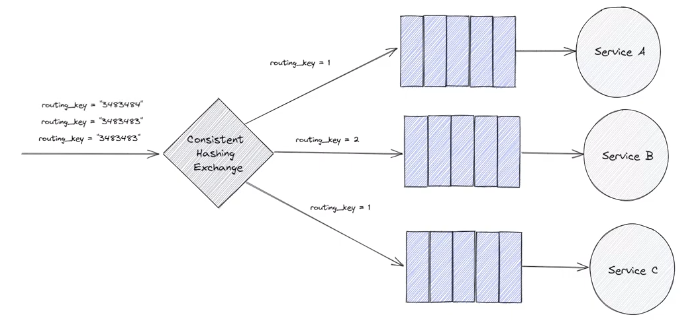

# RabbitMQ

- is a message broker
- like a postal service
- gets msgs from producer to consumer
- producer pushes msg to broker
- broker knows how to get it to its final destination -- producer doesn't need to keep checking in
  - aka ASYNC COMMUNICATION
  - synchronous communication -- e.g. http req -- wait around til api responds -- can't do anything till it does -- eats up resources
- consumers subscribe to msgs that come off broker
- async communication on both ends -- from producer to broker and from broker to consumer
- local runs on port 15672

# Exchange

- heart of msg broker
- knows how to route msg from producer to consumer
- diff types of exchanges for diff types of msgs -- analogous to express vs registered posts in postal service
- producer always sends msg to Exchange
- push msgs into 1+ queue(s)
- diff types (determines whether msg should be sent to just 1 queue, multiple queues, should msg be discarded, etc):
  1. direct
  2. topic
  3. headers
  4. fan-out

# Queue

- where msgs sit till read / consumed by interested consumer(s)
- like a mailbox
- tied to exchanges w/ bindings

# Binding

- Exchange can be tied to multiple Queues
- Queue can be tied to multiple Exchanges

# Connection

- every producer / consumer should open ONE TCP connection to broker
- one connection can have multiple CHANNELS
  - saves resources

# Channel

- could assign one channel to each thread of a producer process
  - msgs in diff channels are isolated from each other

# AMQP

- protocol which rabbitmq runs on
- "open standard" for passing msgs b/t apps
- uses RPC pattern to let one computer to execute programs / methods on another computer
  - like letting client execute method on broker
- 2-way communication

  - both client and broker can use RPC to run programs on each other

- rabbitmq uses cmds which consist of classes and methods to enable communication b/c clients and broker
  - e.g. client can send exchange_declare cmd to broker
    - tells broker to create new exchange
    - class = exchange; method = declare
- data required to execute the cmd is included in a "frame" (just a data structure with a standard structure)
- got multiple frame types defined by AMQP
  1. method frame
  2. content header frame
  3. body frame
  4. heartbeat frame

# Competing Consumers Pattern

- common messaging pattern
- aka Work Queue
- used to distribute time-consuming tasks (e.g. processing an img or doing some ML; sth that would take longer than HTTP window to complete) among multiple workers
  - e.g. producer pops out msgs every 5s and consumer takes 10s to process 1 msg
  - queue will fill up -- so have multiple consumers to avoid out-of-memory issue
- rabbitmq assigns msgs/tasks in queue to subscribed consumers in round robin manner by default

  - round robin isn't ideal when consumers have very diff processing times from each other
  - to overcome this, set prefetch value to 1 so if consumer has 1 msg in flight, it won't assign msg in queue to that consumer

- having a queue completely decouples producers from consumers
  - so if we notice a bunch of waiting tasks in queue, we can just add another consumer to take 1/nth of the load -- ezpz
    - SCALABILITY
  - with this ability to add consumers easily, we make the sys more RELIABLE if 1 consumer / worker dies

# Pub/Sub Pattern

- another common messaging pattern
- like the opposite of Competing Consumers

  - in CC, only 1 worker will get a certain msg
  - in P/S, all workers get a copy of each msg
    - like in microservices architecture, msg could be about new user
      - 1 service for storing in db
      - 1 service for auditing
      - 1 service for handling promotions
    - implementation detail: rabbitmq doesn't actually dup these msgs -- just create 1 msg and have each interested queue keep ref to that msg

- uses fan-out exchange -- will publish each msg to multiple queues
- exchange uses Bindings to determine which queues are interested in its msgs

- service can leverage Temporary Queues rather than declaring a queue upfront
  - only keep the queue around when you're interested in receiving certain msgs

# Smart Routing

- enable services to subscribe to only subset of msgs
- achievable with Topic Exchange / Direct Exchange + smart usage of binding + routing keys

## Direct Exchange

- more flexible routing
- routing algo deps on binding and routing keys to route msg only to interested consumers
- binding key: specific name on some binding
- routing key: what the producer associated with a particular msg
- for Msg X to make it to Queue Y, X's routing key must = binding key b/t exchange and Y

- Payments and Shop services only get subset of msgs from Producer but Analytics service has multiple bindings on its queue which will get all msgs from Producer

## Topic Exchange

- no arbitrary routing key -- must be list of words delimited by dots w/ some meaning to sys or msg being sent
  - e.g. `user.europe.payments` - denotes msg is relevant for `user` entity or any service interested in `user` entity, for region `europe`, deals w/ maybe receiving / sending payment

- illustrates how Topic Exchange is just a superset of Direct Exchange
- Topic Exchange also supports wildcards in binding keys tho
  - `*` means substitute exactly 1 word
  - `#` means substitute 0+ words

# Request-Reply Pattern

- another common messaging pattern
- rather than having simple producer and consumer, now have 2 entities which will both consume and produce msgs -- call em "client" and "server"
- client:
  - sends req to server
  - declares queue that it'll receive replies from
  - pushes reqs to Exchange of unspecified type
  - tells server which queue to push reply to by setting `reply_to` field
  - can also specify the `message_id` and `correlation_id` so client knows which reply corresponds to which req
- server processes req and sends reply

# Exchange to Exchange Routing

- exchanges can be bound not only to queues but also other exchanges

# Headers Exchange

- `x-match: any` means ifcc any of the headers of msg match any of the headers in Binding, route msg along that Binding
- `x-match: all` means only route msg along a Binding if Binding's headers are superset of msg's headers

# Consistent Hashing Exchange

- part of separate plugin that needs to be installed -- not part of rabbitmq installation
  - install on Intel Mac with `/usr/local/opt/rabbitmq/sbin/rabbitmq-plugins enable rabbitmq_consistent_hash_exchange`
- wanna distribute msgs amongst a bunch of workers equally

  - Competing Consumers pattern alr does this but this is just another option if you don't want rabbitmq to decide which queue that msg should go to
    - could decide based on property of msg itself
    - could assign weight to workers (e.g. assign heavier weight to worker w/ better hardware)

- bind Consistent Hashing Exchange to queues w/ `routing_key` equal to some number
  - number denotes weight of msgs which should be assigned to each queue
  - so if they're all 1, then all queues get same number of msgs
  - setting just one of the `routing_key`s to 2 means you want the attached queue to get twice the number of msgs
  - `routing_key` number is directly proportional to how much hashing space each queue gets assigned
  - incoming msg gets its `routing_key` hashed to fall somewhere in this hashing space

- 2 msgs w/ the same `routing_key` will get routed to the same queue / service
- but beware of binding yet another queue to the CHE -- hashing space has changed -- msgs which used to go to Service B might not go to Service B anymore after introducing another queue
